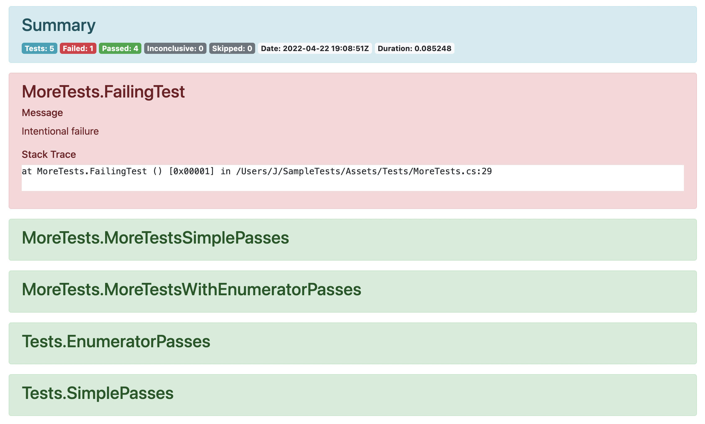

# NUnit HTML Report

This Github Action generates a human-readable HTML report from NUnit XML test results, such as Unity Test Runner.



## Usage

```yaml
- name: Generate HTML test report
  uses: rjtngit/nunit-html-action@v1
  if: always()
  with:
    inputXmlPath: test_results/results.xml
    outputHtmlPath: test_results/results.html
```

## Example

```yaml
steps:
  - name: Run tests
    uses: # your-test-runner
  - name: Make output directory writable # Might be required if you are writing to an existing directory.
    shell: bash
    if: always()
    run: sudo chmod a+w test_results
  - name: Generate HTML test report
    uses: rjtngit/nunit-html-action@v1
    if: always()
    with:
      inputXmlPath: test_results/results.xml
      outputHtmlPath: test_results/results.html
  - name: Upload test artifacts # So you can download the results from the workflow run.
    uses: actions/upload-artifact@v3
    if: always()
    with:
      path: test_results
```

## License

The scripts and documentation in this project are released under the [MIT License](https://github.com/rjtngit/nunit-html-action/blob/main/LICENSE).
